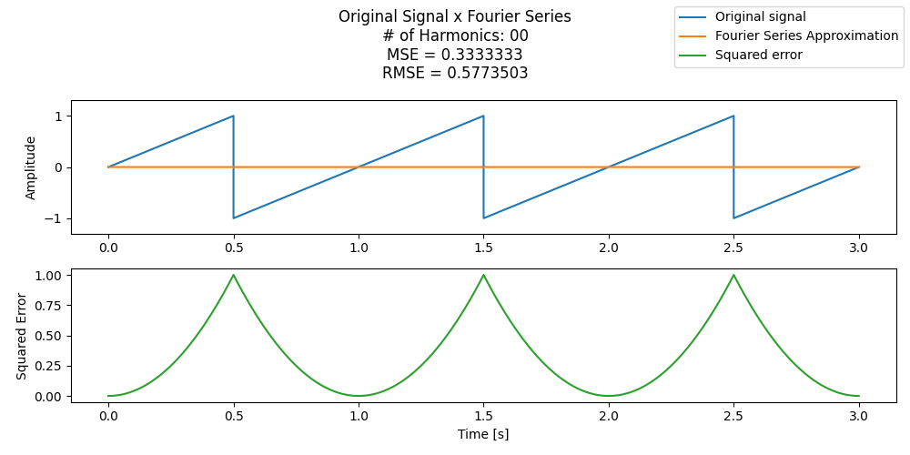

<h1 align="left">Continuous Time Fourier Series</h1>

Calculation of the Fourier coefficients of continuous time periodic functions using Fortran.

<h1 align="left">Linux</h1>

Run the Bash script "fourier_routine" located in the bin folder. Optional arguments are:

- **-h** or **--help**: Displays the optional arguments of the script;
- **-t** or **--period**: Period [s] (> 0.0) of the periodic function. Default is 1.0[s];
- **-d** or **--dc**: DC component of the periodic function. Default is 0.0;
- **-a** or **--amplitude**: Amplitude of the periodic function. Default is 1.0;
- **-p** or **--phase**: Phase shift [rad] of the periodic function. Default is 0.0[rad];
- **-f** or **--function**: Case insensitive name of the periodic function. Options are: SIN or SINE; SQR or SQUARE; SAW or SAWTOOTH; TRI or TRIANGLE. Default is SINE;
- **-e** or **--tolerance**: Tolerance (> 0.0) for the stopping criteria. Default is 0.1.

<h1 align="left">Windows</h1>

The Fortran source code must be compiled manually using MinGW (see the MinGW setup steps [here](https://fortran-lang.org/learn/os_setup/install_gfortran/)). 

Create a build dir and cd() to it. Run the following (or a similar) command-line expression:

`gfortran -o ctfs.exe ../src/functions.f95 ../src/fourier.f95 ../src/ctfs.f95 -O2`

Run the Windows PowerShell script "fourier_routine.ps1" located in the bin folder. Optional arguments are the same as in the Linux version, only with "-" instead of "--" for the long options.

<h1 align="left"></h1> 

**NOTE 1**: The analysis.py script only animates the 50 first harmonics. Python>=3.10 required.

**NOTE 2**: As a safeguard, the Fortran algorithm truncates the series after 1000 coefficients.

